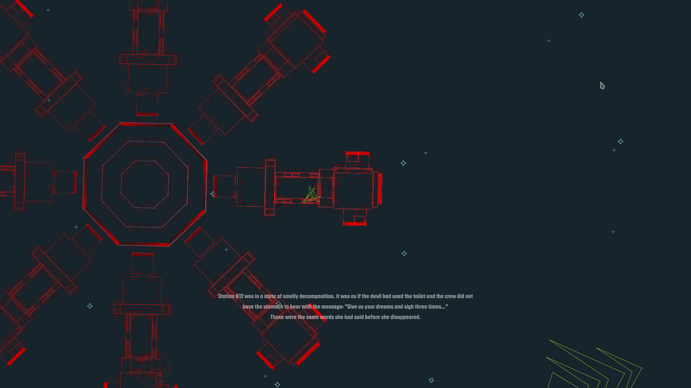
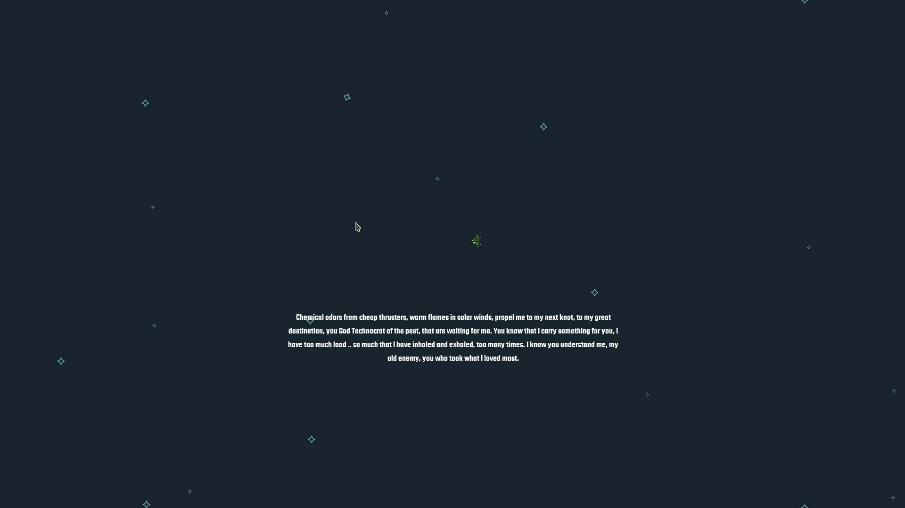

# Fool Gods

> Station B12 was in a state of smelly decomposition, it was as if the devil had used the toilet and the crew did not have the stomach to bear with the message: "Give us your dreams and sigh three times..."
Those were the same words she had said before she disappeared. 

Ludum Dare 36 project by  Miguel Ángel Fernández y Sergi Collado.

## Screenshots

## Links

[Ludum Dare](http://ludumdare.com/compo/ludum-dare-36/?action=preview&uid=56825) 
[itch.io](https://sergicollado.itch.io/ld-fool-gods)

###Board draft

### Contributors
[Sergi Collado](https://twitter.com/sergi_py)
[Miguel Angel Fernandez](https://twitter.com/elmendalerenda)
[Quique Porta](https://twitter.com/quiqueportac)